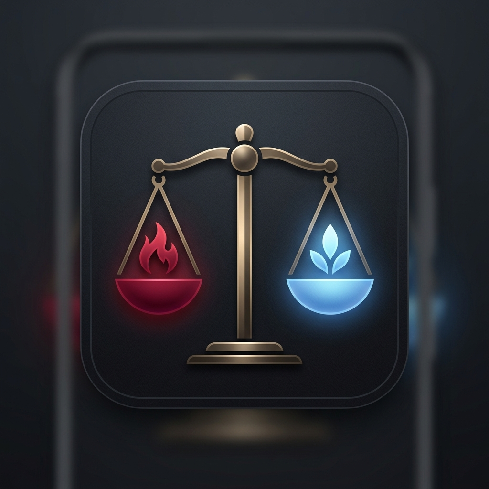

# ViciVirtude - Equilibre Sua Vida

O ViciVirtude é um aplicativo Android focado em privacidade e uso local, projetado para ajudar você a gerenciar seus hábitos, distinguindo entre **Vícios** (hábitos negativos a evitar) e **Virtudes** (hábitos positivos a cultivar).

## Conceitos Centrais
- **Vícios**: Hábitos que você deseja abandonar. A "streak" representa o número de dias desde a sua última "falha". (Tema: **Vermelho**)
- **Virtudes**: Hábitos que você deseja construir. A "streak" representa os dias consecutivos em que você "triunfou". (Tema: **Azul**)

## Principais Funcionalidades
- **Hub do Painel**: Alterne perfeitamente entre Vícios e Virtudes com uma interface fluida e de alto desempenho.
- **Tematização Dinâmica**: As cores de fundo e de destaque do app transitam suavemente conforme você desliza entre as abas.
- **Lembretes Inteligentes**: Receba notificações contextuais ("Lute" vs "Pratique") para manter o foco.
- **Widget da Tela Inicial**: Acompanhe seu foco principal diretamente do seu launcher.
- **Comentários Ricos**: Registre descrições e motivos para cada evento para construir um histórico significativo de sua jornada.
- **Histórico Avançado**: Visualização consolidada com agrupamento, filtragem e estatísticas detalhadas.

## Otimizado para Desempenho
Construído com foco em interações extremamente fluidas:
- **Leitura de Estado Adiada**: O estado da UI é lido apenas durante as fases de desenho/layout para animações a 60FPS.
- **Processamento em Segundo Plano**: Transformações pesadas de dados são processadas fora da thread principal.
- **Buffering de Estado Local**: Zero atraso de entrada durante a digitação de texto.

## Stack Técnica
- **Linguagem**: Kotlin 2.0.21
- **Framework de UI**: Jetpack Compose (Material 3)
- **Arquitetura**: MVVM + Clean Architecture
- **Banco de Dados**: Room (SQLite Local)
- **Framework de Widget**: Jetpack Glance
- **Injeção de Dependência**: Hilt

## Como Começar
1. Abra o projeto no Android Studio.
2. Sincronize os arquivos do Gradle.
3. Execute em um emulador ou dispositivo físico (SDK Mínimo 26).

## Localização
Suporte completo para **Inglês** e **Português (Brasil)**.

---
*Criado com foco em fluidez, equilíbrio e rastreamento consciente de hábitos.*
